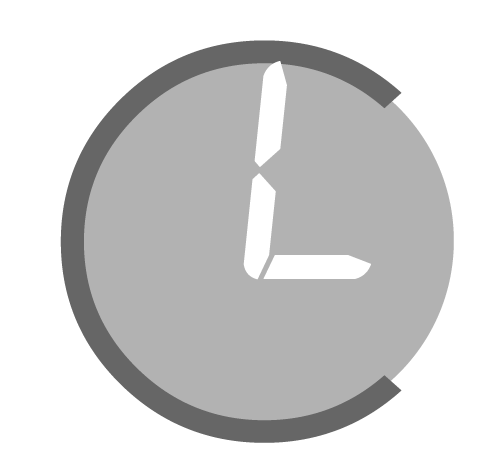

# 📚 Documentación de CuandoLibro

  

Bienvenido a la documentación completa de CuandoLibro, una aplicación web para la administración de pequeñas empresas.

## 📖 Índice

### Para Administradores
1. [Inicio de Sesión](./01-inicio-sesion.md)
2. [Dashboard](./02-dashboard.md)
3. [Gestión de Trabajadores](./03-trabajadores.md)
4. [Gestión de Departamentos](./04-departamentos.md)
5. [Gestión de Categorías](./05-categorias.md)
6. [Gestión de Turnos](./06-turnos.md)
7. [Gestión de Avisos](./07-avisos.md)

### Para Usuarios/Empleados
8. [My Portal - Dashboard Personal](./08-my-portal.md)
9. [My Portal - Horarios](./09-my-portal-horarios.md)
10. [My Portal - Avisos](./10-my-portal-avisos.md)
11. [My Portal - Nóminas](./11-my-portal-nominas.md)

### Configuración y Seguridad
12. [Sistema de Seguridad](./12-seguridad.md)
13. [Sistema de Fichaje](./13-fichaje.md)
14. [Generación de Nóminas](./14-nominas.md)

## 🚀 Inicio Rápido

Si eres **administrador**, comienza por:
- [Inicio de Sesión](./01-inicio-sesion.md)
- [Dashboard](./02-dashboard.md)
- [Gestión de Trabajadores](./03-trabajadores.md)

Si eres **empleado**, consulta:
- [My Portal - Dashboard Personal](./08-my-portal.md)

## 🎯 Características Principales

- **Gestión de Personal**: Alta, baja y modificación de trabajadores
- **Control de Departamentos**: Gestión de presupuestos y gastos
- **Sistema de Turnos**: Creación y asignación de horarios
- **Portal Personal**: Acceso individual para cada empleado
- **Control de Fichaje**: Sistema de seguridad para entrada/salida
- **Sistema de Avisos**: Notificaciones automáticas de incidencias
- **Nóminas Automáticas**: Generación mensual de nóminas

## 📞 Soporte

Para más información sobre la instalación y configuración, consulta el [README principal](../README.md) del proyecto.
